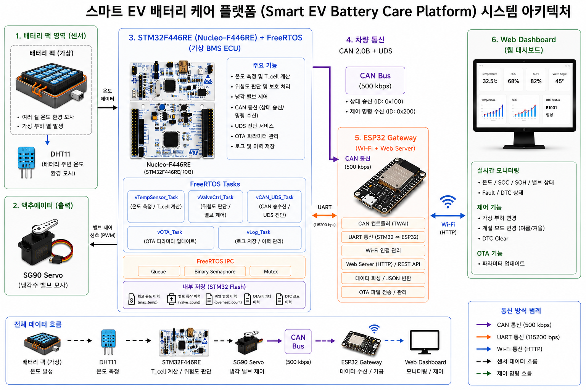

# 🚗 Smart EV Battery Care Platform

STM32 + ESP32로 만든 전기차 배터리 관리 시스템(BMS) 축소 모델입니다. 실제 배터리 팩 대신 온도 센서와 서보모터로 열 관리 상황을 재현하고, 그 위에 자동차 산업에서 쓰는 CAN 통신, UDS 진단, OTA 업데이트 절차를 최대한 표준에 가깝게 구현했습니다.

## 📋 목차

- [개요](#개요)
- [시스템 구성](#시스템-구성)
- [기능](#기능)
- [기술 스택](#기술-스택)
- [CAN 메시지 정의](#can-메시지-정의)
- [보안](#보안)
- [OTA 업데이트](#ota-업데이트)
- [빌드 및 실행](#빌드-및-실행)
- [한계](#한계)
- [디버깅 기록](#디버깅-기록)

## 🔋 개요

진짜 EV 배터리 팩은 크고 비싸서 그대로 재현할 수 없기 때문에, 아래처럼 대체했습니다.

| 실제 BMS | 이 프로젝트 |
|---|---|
| 셀 온도 측정 | DHT11 + 소프트웨어로 만든 가상 부하 |
| 냉각 시스템 | SG90 서보모터로 밸브 개폐 흉내 |
| 배터리 잔량(SOC) | 부하량 기반으로 소프트웨어에서 계산 |
| 배터리 건강도(SOH) | 온도/밸브 이력 기반으로 계산 |

대신 통신 방식(CAN 2.0B, UDS ISO 14229), OTA 업데이트, 최근 추가한 보안 기능은 실제 표준을 따라 구현했습니다.

## 🏗 시스템 구성



STM32는 온도를 읽고 판단하는 두뇌 역할, ESP32는 CAN과 Wi-Fi를 이어주는 게이트웨이 역할을 합니다. 둘은 CAN 버스 하나로만 연결되어 있고, 서로의 내부 코드는 몰라도 CAN ID와 바이트 순서라는 약속만 맞으면 통신이 됩니다.

STM32 내부는 FreeRTOS 다중 태스크로 처음 설계했지만, 여러 태스크가 CAN이나 Flash 같은 자원을 동시에 건드릴 때 생기는 충돌을 줄이기 위해 하나의 시간 기반 스케줄러로 단순화해서 구현했습니다.

| 작업 | 주기 |
|---|---|
| 온도 센서 읽기 | 2.2초 (DHT11 하드웨어 제약) |
| 부하 계산 · CAN 상태 송신 | 0.25초 |
| 이력 데이터 송신 | 5초 |
| Flash 저장 | 20초 (값이 바뀌었을 때만) |

## ✨ 기능

- 히스테리시스 기반 냉각 제어 (정상/주의/위험 3단계, 밸브 0°/45°/90°)
- SOH/SOC 계산 — Flash에 누적된 최고 온도·밸브 동작 횟수·과열 횟수 기반
- CAN 2.0B 상태 방송(0x100)·이력(0x101)·제어 명령(0x200), CRC8 검증
- UDS 진단(ISO 14229) — 0x10 세션 제어, 0x22 데이터 읽기, 0x19 DTC 조회, 0x2E 데이터 쓰기
- 실제 펌웨어 OTA — 스트리밍 수신, 서명 검증, RAM 상주 코드로 Flash 반영, 자동 재부팅
- CAN 메시지 인증 + OTA 서명 (자세한 내용은 아래 [보안](#보안))
- 웹 대시보드 — 실시간 모니터링, UDS 진단 패널, 다크/라이트 모드

## 🛠 기술 스택

| 구분 | 내용 |
|---|---|
| MCU | STM32F446RE (Nucleo), STM32CubeIDE / HAL |
| 게이트웨이 | ESP32 (Arduino), TWAI(CAN), WebServer |
| 센서/액추에이터 | DHT11, SG90 서보모터 |
| 차량 통신 | CAN 2.0B, UDS ISO 14229 |
| 저장 | STM32 내부 Flash |
| 프론트엔드 | HTML/CSS/JS, ESP32가 직접 서빙 |

## 📡 CAN 메시지 정의

| CAN ID | 방향 | 내용 | 주기 |
|---|---|---|---|
| 0x100 | STM32 → ESP32 | 온도·SOC·SOH·고장·밸브·부하·계절 | 250ms |
| 0x101 | STM32 → ESP32 | 누적 이력 | 5초 |
| 0x200 | ESP32 → STM32 | 제어 명령 + 인증 태그 | 이벤트 |
| 0x300~0x303 | 양방향 | OTA 파일 전송 | OTA 중 |
| 0x7A0 / 0x7A8 | 양방향 | UDS 요청/응답 | 이벤트 |

제어 명령(0x200) 코드: `0x01` 부하 변경, `0x02`/`0x03` 여름/겨울 모드, `0x04` DTC 초기화, `0x05~0x0A` 충전·이력 조작·OTA 진입/취소 등.

## 🔐 보안

자동차 업계는 OTA, 통합 컴퓨팅 플랫폼, 사이버보안 컴플라이언스(UN R155, ISO/SAE 21434)를 중심으로 SDV(Software Defined Vehicle)로 넘어가는 중입니다. 이 프로젝트에서는 TARA(위협 분석·위험도 평가) 절차를 간단히 적용해서, 물리적 위험이 큰 두 가지부터 대응했습니다.

- 자산: CAN 제어 명령, OTA 펌웨어, 냉각 밸브
- 위협: 명령 위조, 재전송 공격, 가짜 펌웨어 설치
- 위험도: 밸브 오조작(高), 가짜 펌웨어 반영(高), 이력 위변조(中)
- 우선순위: 高 위험 두 가지부터 구현 → CAN 메시지 인증, OTA 서명

### 🔧 실제로 구현한 것

두 기능 모두 STM32와 ESP32만 아는 32비트 공유 비밀값(`SHARED_SECRET_32`)을 씁니다.

**CAN 메시지 인증**: 제어 프레임에 `[명령, 파라미터1, 파라미터2, 카운터(2바이트), 인증태그(1바이트)]`를 실어 보냅니다. 인증태그는 `CRC8(비밀값 + 명령 + 파라미터 + 카운터)`로 계산하고, STM32가 같은 값을 계산해서 비교합니다. 태그가 다르면 위조로 판단해 거부하고, 카운터가 이전보다 커지지 않았으면 재전송으로 판단해 거부합니다.

**OTA 서명**: 일반 CRC32는 항상 `0xFFFFFFFF`에서 시작하는데, 여기서는 시작값을 `0xFFFFFFFF XOR 비밀값`으로 바꿔서 계산합니다(`crc32_calc_seeded`). ESP32가 업로드된 `.bin` 전체에 대해 이 값을 계산해 CAN으로 같이 보내고, STM32는 자기가 받은 Staging 영역 데이터로 똑같이 계산해서 비교합니다. 값이 다르면 반영을 거부하고 기존 펌웨어를 그대로 유지합니다.

```
서명 계산 순서
  1. ESP32: seed = 0xFFFFFFFF XOR SHARED_SECRET_32
  2. ESP32: signature = CRC32(seed, 펌웨어 전체 바이트)
  3. ESP32 → STM32: 파일 크기 + signature 전송 (CAN 0x300)
  4. STM32: 파일을 Staging 영역에 다 받은 뒤, 같은 방식으로 signature 재계산
  5. 두 값이 같으면 반영, 다르면 거부
```

두 기능 다 CRC 기반 대칭키 방식입니다. STM32와 ESP32가 똑같은 비밀값을 미리 가지고 있어야 하고, 그 값이 새어나가면 방어가 무너집니다. 실제 상용 제품은 HMAC-SHA256이나 RSA/ECDSA 같은 전자서명(비대칭키)을 쓰는데, 이 경우 기기에는 검증용 공개키만 있고 서명을 만드는 개인키는 아예 없어서 기기를 뜯어봐도 위조 서명을 만들 수 없습니다. CRC는 선형 연산이라 이론적으로 역산 여지가 있어서, 여기서는 인증/서명이라는 개념이 실제로 동작한다는 걸 보여주는 수준으로 구현했습니다.

## 🔄 OTA 업데이트

계절 버튼(파라미터 하나만 변경)과 실제 펌웨어 OTA(코드 전체 교체)는 하는 일이 다릅니다.

| | 계절 버튼 | 펌웨어 OTA |
|---|---|---|
| 바꾸는 대상 | 코드 안 숫자 하나(임계치) | 실행 코드 전체 |
| 방식 | CAN 명령 한 번, 즉시 반영 | 스트리밍 → 서명 검증 → Flash 반영 → 재부팅 |
| 실패 시 | 값이 안 바뀔 뿐 | 서명 불일치 시 전체 거부 |

Flash는 지우거나 쓰는 동안 그 메모리를 읽을 수 없어서, 지금 실행 중인 코드 영역을 지우면서 동시에 그 코드를 실행할 수 없습니다. 그래서 마지막 반영 루틴만 `.RamFunc` 섹션으로 지정해 RAM에서 실행되도록 만들었습니다.

Flash 파티션 (STM32F446RE 512KB):

| Sector | 용도 |
|---|---|
| 0~4 | 실행 중인 앱 코드 |
| 5 | OTA 임시 저장(Staging) |
| 6 | 예비 |
| 7 | 이력/설정 저장 |

## 🚀 빌드 및 실행

**필요한 것**: STM32CubeIDE, Arduino IDE(ESP32 보드 패키지), SN65HVD230 CAN 트랜시버 2개, DHT11, SG90 서보모터

1. `main.c`를 STM32CubeIDE 프로젝트에 넣고 빌드해서 ST-Link로 업로드
2. `esp32_bms_gateway.ino`에서 Wi-Fi SSID/PW 수정 후 ESP32에 업로드
3. ESP32 시리얼 모니터에서 IP 확인 후 브라우저로 접속

OTA 테스트 시 서명값 계산:
```
python3 compute_signature.py firmware.bin
```
나온 값을 웹 화면의 서명값 칸에 입력하고 업로드합니다.

## ⚠️ 한계

- CAN 인증/OTA 서명은 대칭키(CRC 기반)라서 실제 제품 수준의 안전성은 없음
- FreeRTOS 다중 태스크로 설계했으나 구현은 시간 기반 스케줄러로 단순화
- UDS Security Access(0x27) 같은 세션 기반 접근 제어는 미구현
- CAN 종단저항 없이 100kbps로 낮춰서 사용 (표준은 500kbps)

## 🐛 디버깅 기록

| 문제 | 원인 | 해결 |
|---|---|---|
| 서보모터가 안 움직임 | 타이머 프리스케일러가 보드 클럭과 안 맞음 | 클럭 기준으로 재계산 |
| CAN 통신 불안정 | 종단저항 없는 환경의 신호 반사 | 속도를 낮추고 CRC8 추가 |
| Flash 저장 시 시스템 멈춤 | Flash 쓰기 중 CAN 수신이 막혀 버퍼 초과 | 저장 시점을 이벤트와 분리 |
| OTA 파일 끝부분 손상 | 4바이트 정렬 안 되는 자투리가 기록 안 됨 | 마지막에 패딩해서 기록 |
| 인터럽트 설정 누락 | NVIC 활성화 누락 | 로그로 원인 좁혀서 확인 |
